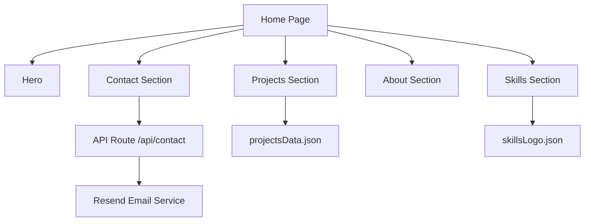

# Developer Guide

This document explains the implementation details of the portfolio for engineers who want to understand, extend, or maintain the project without changing the public GitHub README.

## Purpose

The application is a personal portfolio built with Next.js. It is designed to present the developer profile, highlight projects, and provide a contact flow that sends messages through a serverless API route.

## High-Level Architecture



## Rendering Model

- The app uses the Next.js App Router.
- `src/app/layout.js` defines the shared shell, global styling, motion wrapper, theme bootstrap, navbar, and footer.
- `src/app/page.js` composes the main landing page from reusable sections.
- Route-based pages live under `src/app/(pages)/` for about, projects, skills, and contact.

## Content Flow

- Project cards are driven by `src/app/utility/projectsData.json`.
- Skill icons are driven by `src/app/utility/skillsLogo.json`.
- This keeps content updates separate from layout logic and reduces the chance of accidental UI regressions.

## Contact Flow

1. The contact form collects name, email, subject, and message.
2. The client posts JSON to `POST /api/contact`.
3. The route sends the email through Resend using `RESEND_API_KEY`.
4. The UI shows success or failure feedback with SweetAlert2.

## Local Setup

### Requirements

- Node.js 18 or newer
- A Resend API key if you want the contact form to deliver messages

### Environment Variables

Create a `.env.local` file:

```bash
RESEND_API_KEY=your_resend_api_key
```

### Install and Run

```bash
npm install
npm run dev
```

## Scripts

- `npm run dev` starts the development server with Turbopack.
- `npm run build` creates a production build.
- `npm run start` runs the production server.
- `npm run lint` runs ESLint.

## Conventions

- Prefer keeping visual sections isolated in components rather than inlining large page logic.
- Keep business content in JSON or data modules when it does not need to be computed.
- Avoid changing motion or layout components unless the behavior is intentionally being redesigned.

## Maintenance Notes

- If you add a new project, update the data file first and confirm the projects page still filters correctly.
- If you change the contact endpoint, verify the form still resets and shows the correct SweetAlert2 state.
- If you update global styles, review the layout in both desktop and mobile widths because many sections use custom spacing and overlays.

## Related Files

- [README.md](../README.md)
- [src/app/page.js](../src/app/page.js)
- [src/app/layout.js](../src/app/layout.js)
- [src/app/api/contact/route.js](../src/app/api/contact/route.js)
- [src/app/utility/projectsData.json](../src/app/utility/projectsData.json)
- [src/app/utility/skillsLogo.json](../src/app/utility/skillsLogo.json)
